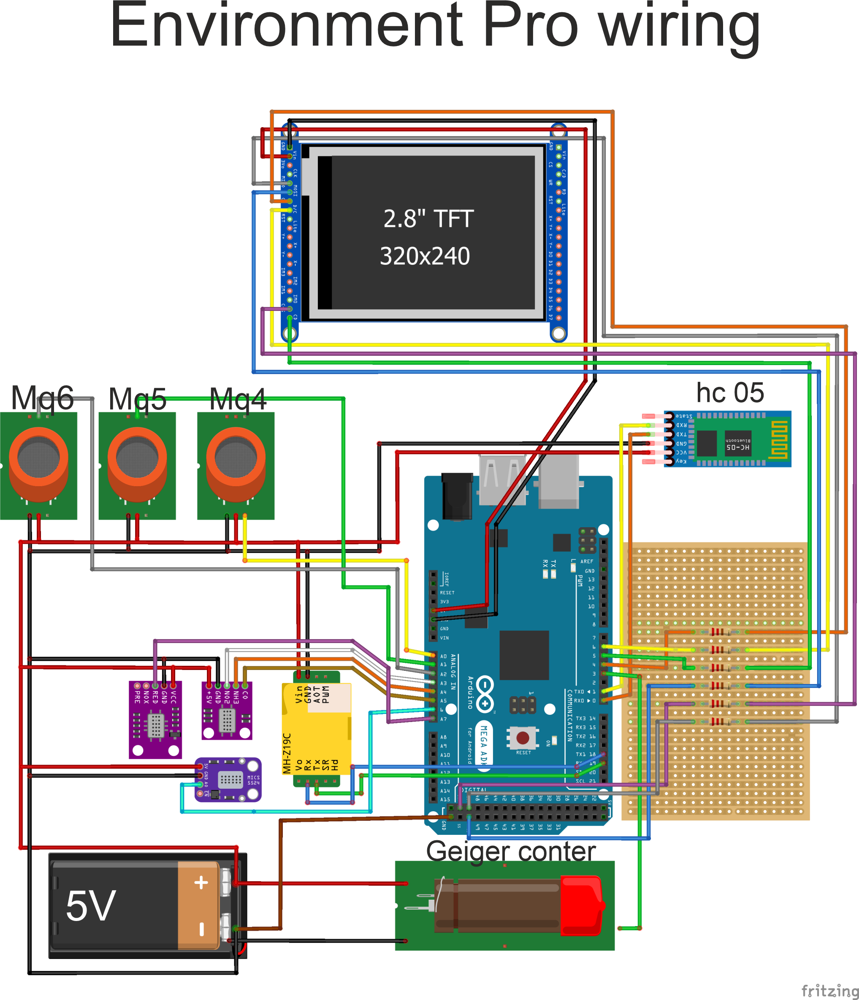
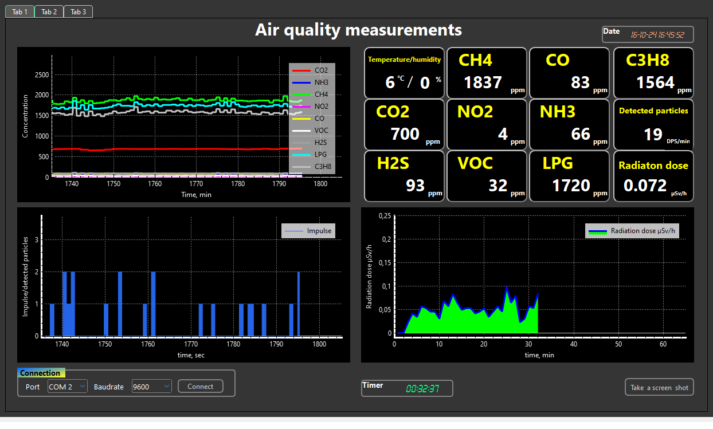
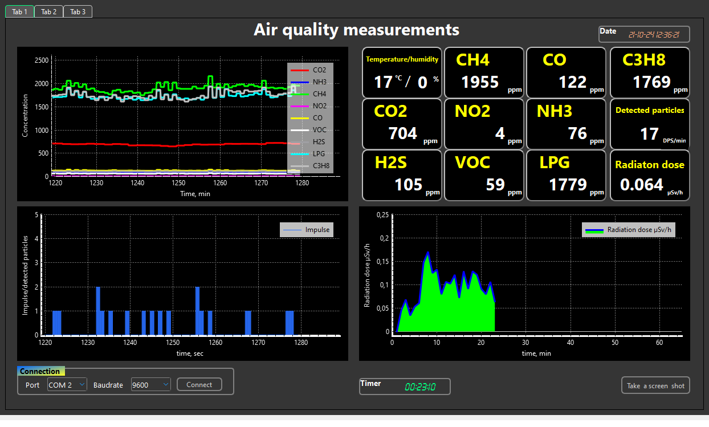
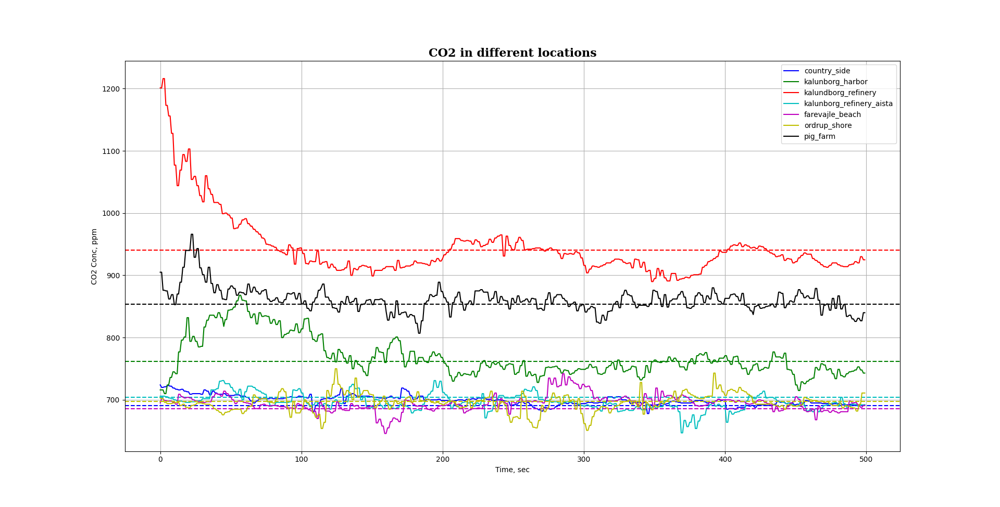
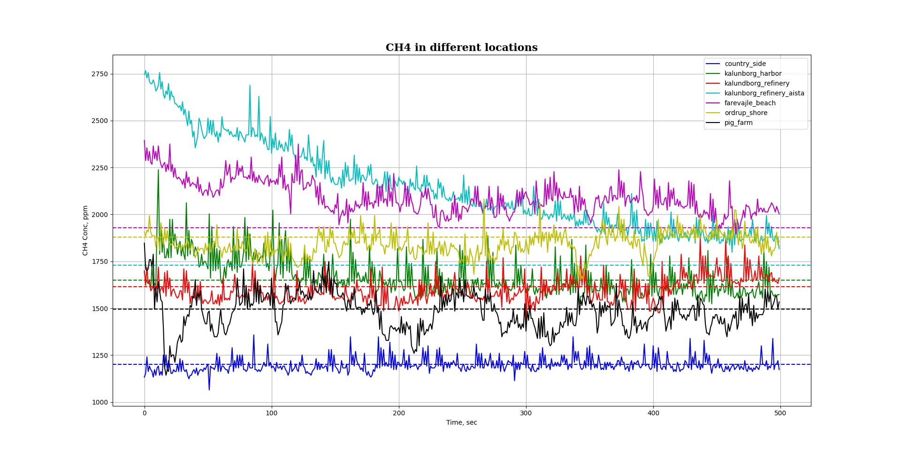

 # EnvoronmentPro # 
 ## The app designed to exhibit and monitor environment data. ##   
 The hardware part is performed on the Arduino Atmega 2560 board. Supplement components are:
 + tft screen 320x240, 2.8'
 + HC-05 bluetooth module
 + Arduino Geiger counter kit
 + gas sensors MQ series: MQ-5, MQ-5, MQ-6
 + gas sensors Mics series: Mics 5524, 6814 and VOC sensor
 + CO2 gas sensor MZH19B.

The wiring scematic is following:

The software implementation was performed on C++ and Qt.
The main idea is following: hardware part reads sensor data, composes JSON lines 
and sends it to the Serial port
The app, receiver, reads serial port, saves JSON to the laptop's HDD and process JSON data, extracts 
information and depicts it in GUI.
The app exhibit realtime plotting for gas sensor's data and for radiations detection.
It has the following apperiance:

Python script allows us to process our JSON information in desirable way, for example, to 
generate plots:

Detail information about hardware and software design process is described here on my 
page:
https://www.hackster.io/Dima_Panasenko/environment-research-with-c-programming-dd3663

 
